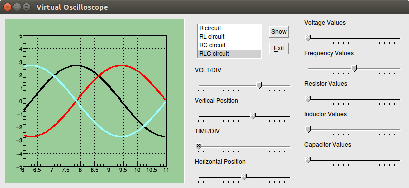

# Virtual Oscilloscope

## 목표

이 프로그램은 가상 오실로스코프이다. 저항 회로(R circuit), 직렬 저항-인덕터 회로(RL circuit), 직렬 저항-축전기 회로(RC circuit), 직렬 저항-인덕터-축전기 회로(RLC circuit)에서 각 소자에 걸리는 전압을 그래프로 볼 수 있다.

## License

© Youngcheor Ra